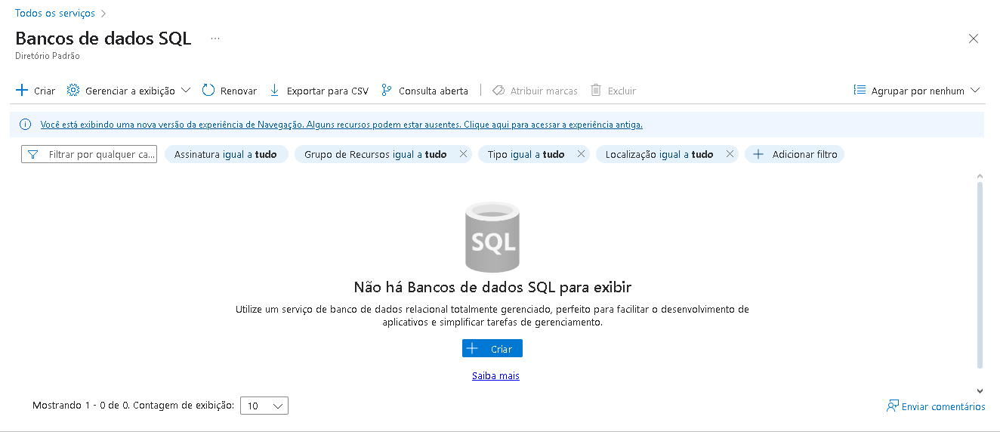

# Laboratório 3 - Microsoft Azure 50 Anos - Configuração de Instância de Banco de Dados no Microsoft Azure

Este laboratório tem como objetivo praticar o processo de configuração de uma instância de Banco de Dados na plataforma Microsoft Azure. O entregável proposto é a criação de um repositório contendo resumos, anotações e dicas sobre o uso da Azure, servindo como material de apoio para estudos e futuras implementações.

O processo de criação de um banco de dados SQL na Plataforma Azure se dá por algumas etapas. Inicialmente, devemos procurar na aba lateral do ambiente Azure o campo _Banco de Dados SQL_ e acessá-lo. Em seguida, é necessário clicar em _Criar_ que será iniciado o procedimento de criação de um banco de dados relacional. Esse procedimento é descrito/realizado através das seguintes etapas: **Básico → Rede → Segurança → Configurações Adicionais → Rótulos → Revisar + Criar.**

## 1. Básico
Nesta seção inicial, especificamos informações fundamentais e de desempenho para a instância do banco de dados SQL.

### Detalhes do Projeto:
- Assinatura: Qual assinatura do Azure será utilizada para provisionar e cobrar o recurso (ex: "Pay-as-you-go").
- Grupo de Recursos: O grupo de recursos ao qual o banco de dados e seus componentes associados (como o servidor lógico) pertencerão.
### Detalhes do Banco de Dados:
- Nome do Banco de Dados: O nome exclusivo para o seu banco de dados.
- Servidor: É necessário criar um novo servidor lógico SQL ou selecionar um existente que hospedará o banco de dados. A criação de um novo servidor inclui definir um nome de servidor globalmente exclusivo, login de administrador e senha, e a região.
- Deseja usar o pool elástico SQL? Opção para usar um pool elástico para compartilhar recursos entre múltiplos bancos de dados.
- Ambiente de carga de trabalho (opcional): Pode-se especificar se o ambiente é de Desenvolvimento ou Produção, o que pode influenciar recomendações.
### Computação + armazenamento:
- Configurar banco de dados (Nível de Serviço): Escolha do modelo de compra (ex: vCore ou DTU), o nível de serviço (ex: Fins Gerais, Comercialmente Crítico, Hyperscale, Básico, Standard, Premium), e a configuração de hardware (número de vCores, quantidade de memória). Esta escolha impacta diretamente o desempenho, funcionalidades disponíveis e o custo.
- Tamanho máximo dos dados: Define o limite de armazenamento para o banco de dados.
- Redundância de armazenamento de backup: Opções para redundância do armazenamento dos backups (ex: localmente redundante, com redundância geográfica).

## 2. Rede
Aqui, configuramos como o banco de dados será acessado e protegido em nível de rede.

- Método de Conectividade: Define se o banco de dados será acessível através de um "Ponto de extremidade público" (via internet), "Nenhum acesso", ou se o acesso será restrito via "Ponto de extremidade privado" (Private Link para integração com redes virtuais).
- Regras de Firewall: Permite criar regras para especificar quais endereços IP ou intervalos de IP de clientes têm permissão para se conectar ao servidor de banco de dados. Inclui opções rápidas como "Adicionar endereço IP do cliente atual" e "Permitir que serviços e recursos do Azure acessem este servidor".
- Política de conexão: Define a política de conexão (ex: Padrão, Redirecionamento, Proxy).
- Conexões Criptografadas: Configuração da versão mínima do TLS (Transport Layer Security) para conexões seguras.

## 3. Segurança
Esta seção aborda as configurações de autenticação, proteção contra ameaças e criptografia.

- Microsoft Defender para SQL: Opção para habilitar esta funcionalidade que oferece proteção avançada contra ameaças, avaliação de vulnerabilidades e alertas de segurança.
- Ledger (opcional): Permite criar um banco de dados ledger, que fornece evidência de violação criptográfica dos dados.
- Identidade: Configuração de identidades gerenciadas atribuídas pelo sistema ou pelo usuário para o servidor SQL, permitindo autenticação segura com outros serviços do Azure.
- Criptografia de dados: Geralmente, a Transparent Data Encryption (TDE) está habilitada por padrão, usando chaves gerenciadas pela Microsoft ou pelo cliente (BYOK).
- Autenticação do Microsoft Entra: Permite configurar a autenticação usando o Microsoft Entra ID (anteriormente Azure Active Directory) como método principal ou secundário, além da autenticação SQL. É possível definir o principal de administrador do Microsoft Entra.

## 4. Configurações Adicionais
Esta etapa permite configurar outros aspectos importantes do banco de dados.

- Usar dados existentes (Origem de dados): Opção para criar um banco de dados "Em Branco", usar um banco de dados de "Exemplo" (ex: AdventureWorksLT) ou "Restaurar" de um backup.
- Collation: Define as regras de ordenação, diferenciação de maiúsculas/minúsculas e acentuação para os dados de caracteres no banco de dados. O padrão geralmente é ___SQL_Latin1_General_CP1_CI_AS___.
- Janela de manutenção: Permite escolher uma janela de tempo pré-definida para atualizações de serviço e patches, minimizando o impacto em cargas de trabalho críticas.

## 5. Rótulos
___Rótulos___ (conhecidos no portal Azure também como _Marcas_ ou _Tags_) são pares de nome/valor que permitem categorizar e organizar os recursos do Azure. Eles são muito úteis para o gerenciamento de custos (rastreando despesas por projeto, departamento, etc.), automação e para exibir faturamento consolidado ao aplicar o mesmo rótulo a vários recursos e grupos de recursos.

## 6. Revisar + Criar
Este é o estágio final, onde o Azure valida todas as configurações escolhidas nas etapas anteriores.

- Resumo: Uma visão geral de todas as opções selecionadas é apresentada para revisão final.
- Custo Estimado: Uma estimativa do custo mensal para operar o serviço com as configurações definidas é exibida.
- Termos Legais: Links para os termos de serviço e privacidade.
- Ao clicar em _Criar_, o Azure inicia o processo de provisionamento da instância do Banco de Dados SQL e do servidor lógico, se aplicável.

### Informações Adicionais
O portal Azure frequentemente oferece links para documentação em cada opção de configuração, detalhando seu funcionamento. A escolha do nível de serviço e da configuração de computação + armazenamento na aba "Básico" é uma das decisões mais impactantes no custo e desempenho do seu Banco de Dados SQL. É fundamental analisar os requisitos da aplicação para fazer a escolha mais adequada.

